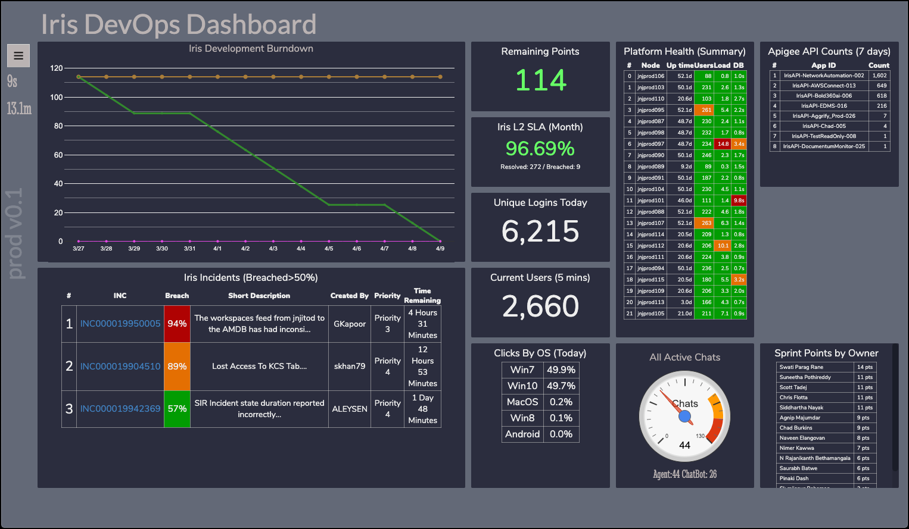

# Project Description

This is a dashboard (information radiator ?) that displays a number of small widgets, each containing a discrete tidbit of information (e.g. Number of users logged in today, Number of breached incidents today, etc). The dashboard obtains all its information by calling different APIs, and rendering that information using a combination of React, Google Charts, and native CSS Grids. Every 60 seconds (user configurable), it calls the APIs again, updates the React state of each widget (compmonent), and then React dutifully re-renders.

Want to help me ? Great ! I'm glad you asked. Please fork the project, deploy locally, make some awesome changes, and then issue a pull request against the master branch.



# Project History

The first version of this dashboad was written in AngularJS. It was meant as an exercise to learn AngularJS. Two years later, the dashboard proved continued to prove itself useful and I was still using it on a regular basis. But enhancments felt unwieldy. As another experiment, I spent the Winter of 2018/2019 re-writing it in React. While the React version is less DRY, it feels much easier to understand (and consequently remember). Previously, when I didn't touch the code for two weeks, and then dropped back into it, it felt like I was spending 15 minutes to get my bearings within my own code. That felt silly. In React, all the working parts of a single widget are in a single file (e.g. API call to generate the data, and the HTML/Javascript to display the corresponding result). Sure, much less DRY since each React component had a lot of repeated code, but React still feels like the right solution for this project. Happy with the re-write.

## Detailed History: Differences between the AngularJS and React Dashboard

1. Using React rather than AngularJS (duh..)
1. Using NodeJS/Express for the API proxy rather than Python/Flask (that's another story)
1. Replaced CSS Masonry with CSS Grid, which was ratified in CSS3, and it
1. With CSS Grid, it's easy to specify position of card/widget, and also allow it to float into empty grid space if desired.
1. Added Semantic UI, but not really using it yet (but want to)

## History: What I'm learning

1. Even though my initial design in React is less DRY than AngularJS, feels a lot easier to understand
1. Replaced Python API with a simple proxy using NodeJS Express. Moved all logic from backend to frontend
    1. That means backend is a simple proxy which only adds authentication on the way through
1. For View, AngularJS wasnt great at looping through an Object. Since React is just javascript, it can do it

## History: Widget Updating Strategies

I've tried three different strategies for periodic data updates for each widget.

1. Widget has it's own custom-length timer (didn't like this, as it means it would be difficult to look at a dashboard screen full of widgets, and understand when each would be updating. Also required using a reactSafe setTimemout, which in turn required each widget to be wrapped in a ReactTimeout). That in turn, caused confusing when I was trying to reference each widget.
1. Parent (Card Grid) has a custom-length timer, and uses React Ref to call Widget's Update Function (didn't like this solution as it means the Parent/CardGrid would have to manage alot of refs, onc for each widget)
1. Parent (Card Grid) has a custom-length timer, and simply issues a global PubSub event, which all widgets will listen for. Feels like the most elegant, and it's the methond I'm using. Only downside is PubSub is constrained to a single-process application (which this is)

In all cases, I started with a javascript setTimeout() timer; however, I like displaying the remaining time before the next refresh. In the case of Javascript setTimeout(), you cannot query the remaining time. So, I ended up converting to a series of 1-second timeouts which keep track of remaining time. That gives me a hook to update the remaining timer display. Only downside is that each loop iteration is actually 1 second, plus the time it takes for the update code to run, and re-trigger the 1 second timeout. I'd have to check, but I think I fixed this by calling the 1 second timeout as the _first_ element of the event loop (rather than waiting until the end)

# Would you like to contribute ?

## Deploying (and Developing) Locally

1. Clone this repo to your local machine
1. npm install
1. npm start
1. Get coding

NOTE: Before you do anything too complicated (e.g. creating your own widget), I'd suggest that you coordinate with me (Chad). Something like this:

1. Give me a head's up that you'd like to contribute
1. Attempt to clone the repo locally, and get it running
1. Make a minor code tweak, and then perform a Pull Request against the master branch
1. I'll take care of all deployments into the release branch

# Production Deployment Instructions

## Create a host

-   Launch a new Redhat (RHEL) Instance (Currently tested on RHEL7 2018 Q2)
    -   Select t2.large
    -   Add tags (Environment and Application)
    -   Select a security group (Default, Web, and Database)
    -   Define IAM Role
    -   Launch (without keys)

## Prep host for Installation of React Dashboard

-   yum install httpd git vim
-   useradd dashboard-api-proxy
-   useradd dashboard-react
-   curl -sL https://rpm.nodesource.com/setup_10.x | bash -
-   yum install -y nodejs

## Install and Deploy React Dashboard

-   vim /etc/systemd/system/dashboard-react.service

```
[Unit]
Description=Node.js React Dashboard Application

[Service]
ExecStart=/bin/node /var/www/nodejs/dashboard-react/server.js
# Required on some systems
#WorkingDirectory=/opt/nodeserver
Restart=always
# Restart service after 10 seconds if node service crashes
RestartSec=10
# Output to syslog
StandardOutput=syslog
StandardError=syslog
SyslogIdentifier=react-dashboard
User=dashboard-react
#Group=<alternate group>
Environment=NODE_ENV=production PORT=5439

[Install]
WantedBy=multi-user.target
```

-   systemctl enable dashboard-react.service
-   systemctl daemon-reload
-   systemctl restart dashboard-react
-   Deploy the actual app
    -   cd /var/www
    -   mkdir nodejs
    -   cd nodejs
    -   mkdir dashboard-react
    -   cd dashboard-react
    -   git clone https://github.com/cburkins/react-mini-dashboard.git .
    -   Create .env file -
    -   ./deploy.sh

## Install and Deploy API Gateway

NOTE: As you'll see, this is a separate rep

1. Log into _same_ host as above
1. sudo su -
1. cd /var/www
1. mkdir dashboard-api-proxy; cd dashboard-api-proxy
1. git clone https://github.com/cburkins/nodejs-express-gateway.git .
1. npm install
1. chown -R dashboard-api-proxy .
1. vim /etc/systemd/system/dashboard-api-proxy.service

```
[Unit]
Description=Node.js Example Server

[Service]
ExecStart=/bin/node /var/www/nodejs/dashboard-api-proxy/server.js
# Required on some systems
# WorkingDirectory=/opt/nodeserver
Restart=always
# Restart service after 10 seconds if node service crashes
RestartSec=10
# Output to syslog
StandardOutput=syslog
StandardError=syslog
SyslogIdentifier=nodejs-example
User=dashboard-api-proxy
#Group=<alternate group>
Environment=NODE_ENV=production PORT=1521

[Install]
WantedBy=multi-user.target
```

1. systemctl enable dashboard-api-proxy.service
1. systemctl daemon-reload
1. systemctl restart dashboard-api-proxy
1. Create config files (so that the API Proxy can call the backend)
    1. As each API has a slightly different authentication mechanism, each config file is slightly different
    1. Here's an example of the ServiceNow configuration file

```
{
    "jnjsandbox.service-now.com": {
        "Description": "OAuth Credentials for user irs-dashboard, will require extra call to get access_token",
        "Authentication": {
            "client_id": "xxxxxxxxxxxxxxxxxxxxxxxxxxxx",
            "client_secret": "yyyyyyyyyy",
            "username": "service-account-user",
            "password": "zzzzzzzzzzzzz"
        }
    },
    "jnjprodworker.service-now.com": {
        "Description": "OAuth Credentials for user irs-dashboard, will require extra call to get access_token",
        "Authentication": {
            "client_id": "xxxxxxxxxxxxxxxxxxxxxxxxxxxx",
            "client_secret": "yyyyyyyyyy",
            "username": "service-account-user",
            "password": "zzzzzzzzzzzzz"
        }
    }
}
```

test mod
